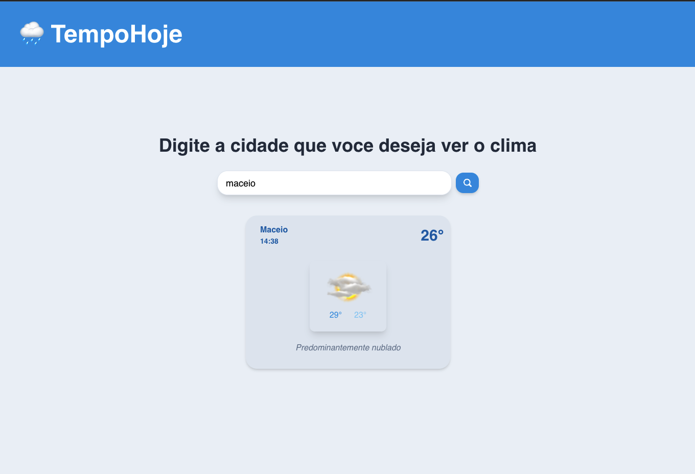

<h1 align="center">
<br>
   TempoHoje🌧
  
</h1>

<h4 align="center">
  Weather App with React and Chakra UI.
</h4>
<p align="center">
 

  
  <a href="https://github.com/VictorG1002/TempoHoje/commits/master">
    
  </a>

 
  </a>

  
</p>

<p align="center">
  <a href="#rocket-technologies">Technologies</a>&nbsp;&nbsp;&nbsp;|&nbsp;&nbsp;&nbsp;
  <a href="#information_source-how-to-use">How To Use</a>&nbsp;&nbsp;&nbsp;
</p>




## 🚀 Technologies

This project was developed to compose a portfolio with the following technologies:

-  [ReactJS](https://reactjs.org/)
-  [ChakraUI](https://chakra-ui.com/)
-  [Axios](https://github.com/axios/axios)
-  [VS Code][vc] 

##  📚 How To Use


```bash
# Clone this repository
$ git clone https://github.com/VictorG1002/TempoHoje.git

# Go into the repository
$ cd TempoHoje

# Install dependencies
$ npm install

# Run the app
$ npm start
```


Made with ♥ by Victor Oliveira ➡️ [Get in touch!](https://www.linkedin.com/in/lukemorales/)

[nodejs]: https://nodejs.org/
[yarn]: https://yarnpkg.com/
[vc]: https://code.visualstudio.com/
[vceditconfig]: https://marketplace.visualstudio.com/items?itemName=EditorConfig.EditorConfig
[vceslint]: https://marketplace.visualstudio.com/items?itemName=dbaeumer.vscode-eslint
